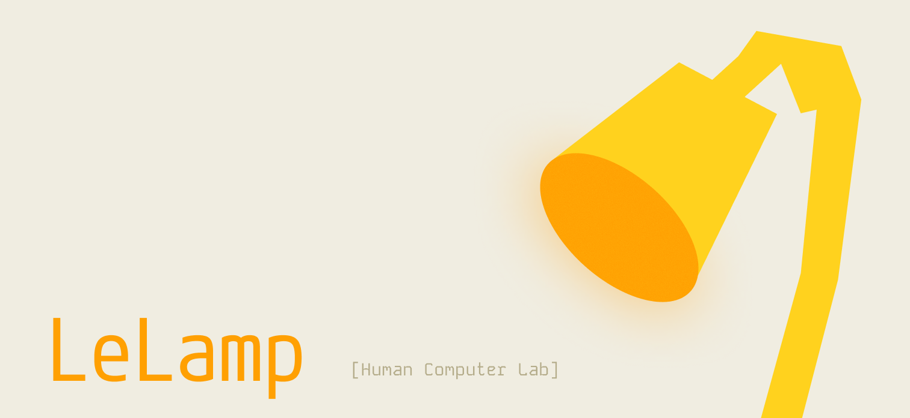

# LeLamp 运行时系统



本仓库包含控制LeLamp的代码。运行时系统为机器人台灯提供了全面的控制系统，包括电机控制、录音/回放功能、语音交互和测试功能。

[LeLamp](https://github.com/humancomputerlab/LeLamp) 是一个基于 [Apple's Elegnt](https://machinelearning.apple.com/research/elegnt-expressive-functional-movement) 的开源机器人台灯，由 [[Human Computer Lab]](https://www.humancomputerlab.com/) 制作。

## 概述

LeLamp 运行时系统是一个基于Python的控制系统，与LeLamp的硬件组件进行交互，包括：

- 用于关节运动的伺服电机
- 音频系统（麦克风和扬声器）
- RGB LED照明
- 摄像头系统
- 语音交互功能

## 项目结构

```
lelamp_runtime/
├── main.py                 # 主运行时入口点
├── pyproject.toml         # 项目配置和依赖
├── lelamp/                # 核心包
│   ├── setup_motors.py    # 电机配置和设置
│   ├── calibrate.py       # 电机校准工具
│   ├── list_recordings.py # 列出所有录制的电机运动
│   ├── record.py          # 运动录制功能
│   ├── replay.py          # 运动回放功能
│   ├── follower/          # 跟随者模式功能
│   ├── leader/            # 领导者模式功能
│   └── test/              # 硬件测试模块
└── uv.lock               # 依赖锁定文件
```

## 安装

### 前置要求

- UV包管理器
- 硬件组件正确组装（参见主LeLamp文档）

### 设置

1. 克隆运行时仓库：

```bash
git clone https://github.com/humancomputerlab/lelamp_runtime.git
cd lelamp_runtime
```

2. 安装UV（如果尚未安装）：

```bash
curl -LsSf https://astral.sh/uv/install.sh | sh
```

3. 安装依赖：

```bash
# 基本功能
uv sync

# 硬件支持（树莓派）
uv sync --extra hardware
```

**注意**：对于电机设置和控制，LeLamp运行时可以在您的计算机上运行，您只需要运行 `uv sync`。对于连接到头部树莓派的其他功能（LED控制、音频、摄像头），您需要在该树莓派上安装LeLamp运行时并运行 `uv sync --extra hardware`。

如果您遇到LFS问题，请运行以下命令：

```bash
GIT_LFS_SKIP_SMUDGE=1 uv sync
```

如果您的安装过程很慢，请使用以下环境变量：

```bash
export UV_CONCURRENT_DOWNLOADS=1
```

### 依赖

运行时包含几个关键依赖：

- **feetech-servo-sdk**：用于伺服电机控制
- **lerobot**：机器人框架集成
- **livekit-agents**：实时语音交互
- **numpy**：数学运算
- **sounddevice**：音频输入/输出
- **adafruit-circuitpython-neopixel**：RGB LED控制（硬件）
- **rpi-ws281x**：树莓派LED控制（硬件）

## 核心功能

### 1. 电机设置和校准

在使用LeLamp之前，您需要设置和校准伺服电机：

1. **查找伺服驱动器端口**：

```bash
uv run lerobot-find-port
```

2. **使用唯一ID设置电机**：

```bash
uv run -m lelamp.setup_motors --id your_lamp_name --port the_port_found_in_previous_step
```

3. **校准电机**：

设置电机后，校准它们以获得准确的定位：

```bash
uv run -m lelamp.calibrate --id your_lamp_name --port the_port_found_in_previous_step
```

校准过程将：

- 校准跟随者和领导者模式
- 确保正确的伺服定位和响应
- 为准确运动设置基准位置

### 2. 单元测试

运行时包含全面的测试模块来验证所有硬件组件：

#### RGB LED

```bash
# 使用sudo运行以获得硬件访问权限
sudo uv run -m lelamp.test.test_rgb
```

#### 音频系统（麦克风和扬声器）

```bash
uv run -m lelamp.test.test_audio
```

#### 摄像头

```bash
# 测试摄像头功能
libcamera-hello
```

#### 电机

```bash
uv run -m lelamp.test.test_motors --id your_lamp_name --port the_port_found_in_previous_step
```

这可以在您的计算机上运行，而不是在台灯头部的树莓派Zero 2W上。

### 3. 录制和回放动作序列

LeLamp的关键功能之一是能够录制和回放运动序列：

#### 录制运动

要录制运动序列：

```bash
uv run -m lelamp.record --id your_lamp_name --port the_port_found_in_previous_step --name movement_sequence_name
```

这将：

- 将台灯置于录制模式
- 允许您手动操作台灯
- 将运动数据保存到CSV文件

#### 回放运动

要回放录制的运动：

```bash
uv run -m lelamp.replay --id your_lamp_name --port the_port_found_in_previous_step --name movement_sequence_name
```

回放系统将：

- 从CSV文件加载运动数据
- 以适当的时序执行录制的运动
- 重现原始运动序列

#### 列出录制内容

要查看特定台灯的所有录制内容：

```bash
uv run -m lelamp.list_recordings --id your_lamp_name
```

这将显示：

- 指定台灯的所有可用录制内容
- 文件信息，包括行数
- 可用于回放的录制名称

#### 文件格式

录制的运动保存为CSV文件，命名约定为：
`{sequence_name}_{lamp_id}.csv`

## 4. 开机自启动

要在开机时启动LeLamp的语音应用，创建systemd服务文件：

```bash
sudo nano /etc/systemd/system/lelamp.service
```

添加以下内容：

```bash
ini[Unit]
Description=Lelamp Runtime Service
After=network.target

[Service]
Type=simple
User=pi
WorkingDirectory=/home/pi/lelamp_runtime
ExecStart=/usr/bin/sudo uv run main.py console
Restart=always
RestartSec=5

[Install]
WantedBy=multi-user.target
```

然后启用并启动服务：

```bash
sudo systemctl daemon-reload
sudo systemctl enable lelamp.service
sudo systemctl start lelamp.service
```

其他服务控制：

```bash
# 禁用开机自启动
sudo systemctl disable lelamp.service

# 停止当前运行的服务
sudo systemctl stop lelamp.service

# 检查状态（应显示"disabled"和"inactive"）
sudo systemctl status lelamp.service
```

## 示例应用

用于测试LeLamp功能的示例应用。

### LiveKit语音代理

要在LeLamp上运行对话代理，在您的树莓派上的此目录根目录中创建一个.env文件，内容如下：

```bash
OPENAI_API_KEY=
LIVEKIT_URL=
LIVEKIT_API_KEY=
LIVEKIT_API_SECRET=
```

关于如何获取这些信息，请参考 [LiveKit指南](https://docs.livekit.io/agents/start/voice-ai/)。

然后您可以通过以下方式运行代理应用：

```bash
# 只需要运行一次
sudo uv run main.py download-files

# 对话AI
sudo uv run main.py console
```

## 故障排除

### 常见问题

1. **伺服连接问题**：

   - 验证USB连接到伺服驱动器
   - 检查端口权限
   - 确保电源供应正确
   - 确保您的伺服电机具有正确的ID

2. **音频问题**：

   - 验证ReSpeaker Hat安装
   - 检查ALSA配置
   - 使用 `aplay -l` 和 `arecord -l` 测试
   - 确保您通过在alsamixer中点击相应滑块上的M来取消静音扬声器。

3. **权限错误**：

   - 使用 `sudo` 运行RGB测试
   - 检查用户硬件访问权限

4. **Sudo声音错误**：

将以下内容放入 /etc/asound.conf：

```bash
# 默认捕获和播放设备 = Seeed 2-Mic
pcm.!default {
    type plug
    slave {
        pcm "hw:3,0"      # 输入/输出设备（Seeed 2-Mic）
    }
}

ctl.!default {
    type hw
    card 3
}
```

注意：声卡编号应根据 `aplay -l` 的输出进行更改。

## 贡献

这是Human Computer Lab的开源项目。欢迎通过GitHub仓库贡献。

## 许可证

查看主 [LeLamp仓库](https://github.com/humancomputerlab/LeLamp) 了解许可证信息。
